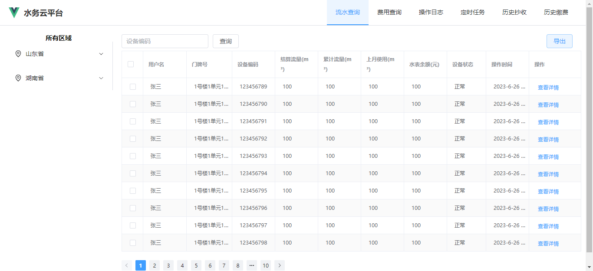
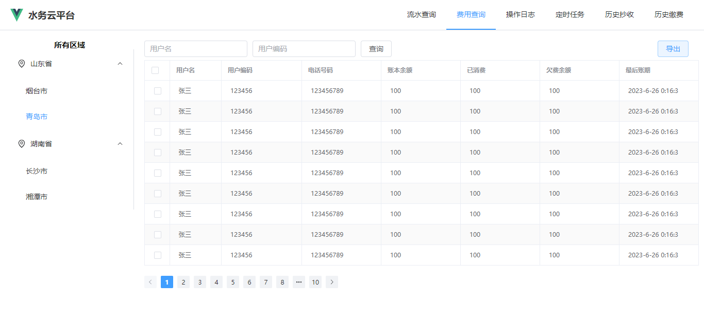
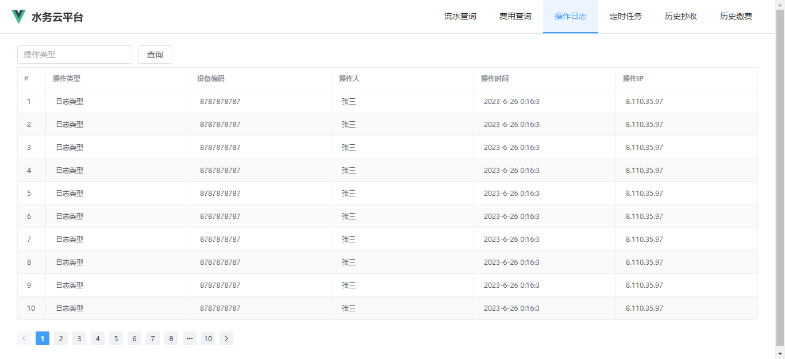
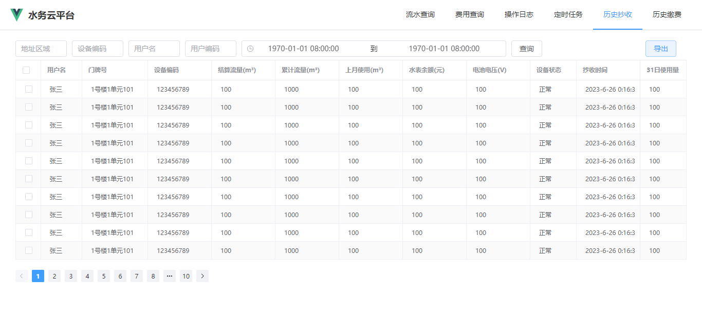
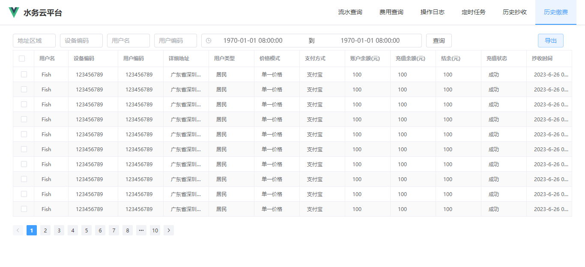

水务云平台 - 前端信息查询部分

#### 1. 实现技术

* Vue3 + Pinia状态管理 + ElementPlus组件库

* Axios + Nprogress

#### 2. 运行截图












#### 2. APi接口

**接口文档**：见`resources/file/apidoc/pdf`

**接口Mock信息**：见`resources/file/apimock.json`

**接口Mock配置**

```json
[{
  "name": "历史缴费",
  "url": "/hispay",
  "method": "get",
  "on": true
}, {
  "name": "历史抄收",
  "url": "/trans",
  "method": "get",
  "on": true
}, {
  "name": "定时任务",
  "url": "/schedule",
  "method": "get",
  "on": true
}, {
  "name": "操作日志",
  "url": "/opt",
  "method": "get",
  "on": true
}, {
  "name": "费用查询",
  "url": "/cost",
  "method": "get",
  "on": true
}, {
  "name": "流水查询",
  "url": "/flow",
  "method": "get",
  "on": true
}, {
  "name": "区域查询",
  "url": "/region",
  "method": "get",
  "on": true
}]
```

**在线Mock根地址** ： https://www.fastmock.site/mock/24acc0e55e257144c1303aacd020a1ef/v1
